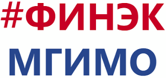

# Technical Communications Course 

The minor for MGIMO students about technical communications in IT projects.



## Install and set up

Take part in course using Google Meet and your attention.

```
$ cd ../lorem
$ npm install
$ npm start
```

## Technologies
Project is created with:
* Lorem version: 12.3
* Ipsum version: 2.33
* Ament library version: 999

## Kudos 

Kudos to Finek faculty and Evgeny Pogrebniak. 

